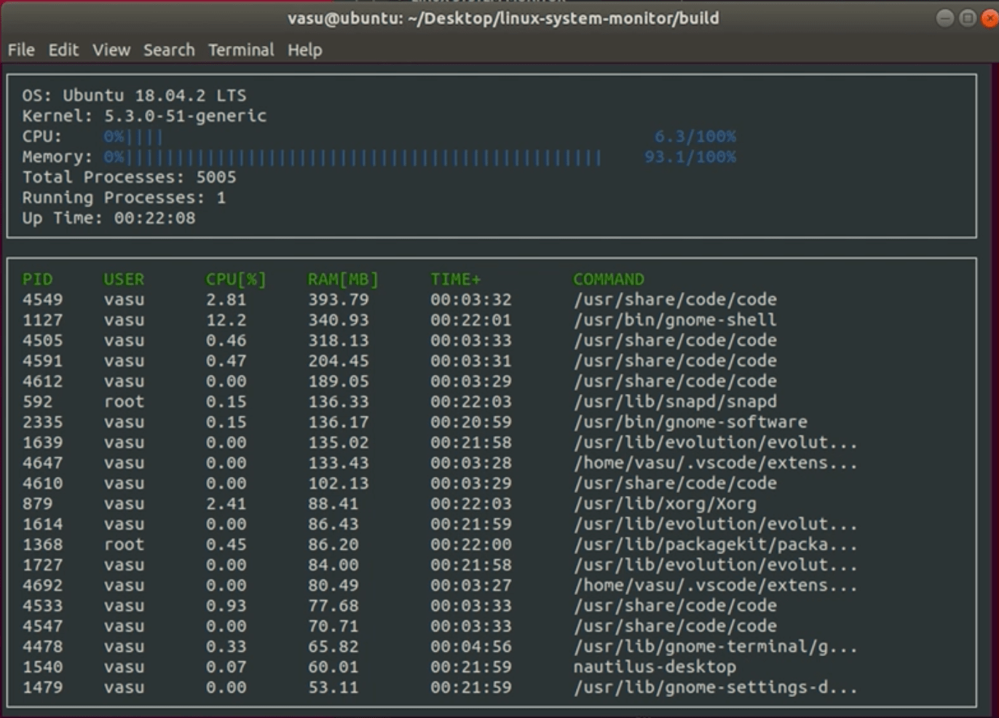

# Linux System Monitor

Interactive system-monitor and process-viewer for linux built using ncurses API to create test-based user interface in the 
shell that resembles the htop program on linux. Users of the program can view system information, active processor utilization
and individual processes sorted by memory utilization.

     

