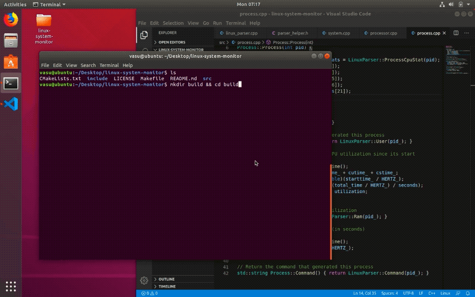

# Linux System Monitor
Interactive system-monitor and process-viewer for linux built using ncurses API to create test-based user interface in the 
shell that resembles the htop program on linux. Users of the program can view system information, active processor utilization
and individual processes sorted by memory utilization.
<p align="center">
     
</p>


## Cloning
You can clone the repository with HTTPS:
```
https://github.com/VasuGoel/linux-system-monitor.git
```
or with SSH:
```
git@github.com:VasuGoel/linux-system-monitor.git
```

## Dependencies
* cmake >= 3.11.3 : `sudo apt-get install cmake`

* make >= 4.1 : `sudo apt-get install make`

* gcc/g++ >= 7.4.0 : `sudo apt-get install gcc g++`

* ncurses : `sudo apt install libncurses5-dev libncursesw5-dev`

## Make
This project uses [Make](https://www.gnu.org/software/make/). The Makefile has four targets:
* `build` compiles the source code and generates an executable
* `format` applies [ClangFormat](https://clang.llvm.org/docs/ClangFormat.html) to style the source code
* `debug` compiles the source code and generates an executable, including debugging symbols
* `clean` deletes the `build/` directory, including all of the build artifacts

## Compiling and Running

### Compiling
To compile the project, create a `build` directory and `cd` into that directory:
```
mkdir build && cd build
```
From within the `build` directory, run `cmake` and `make` as follows:
```
cmake ..
make
```

### Running
The executable will be placed in the `build` directory. From within `build`, you can run the project as follows:
```
./monitor
```

<p align="center">
     
</p>


